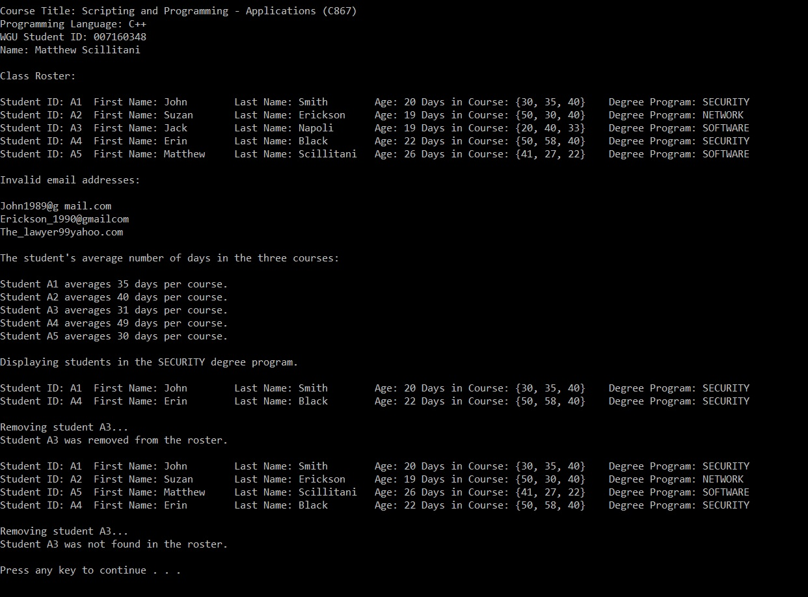

# C867 Class Roster
'Scripting and Programming Applications'

## Output
If you were to run this program, this would be the output:

## Project Requirements

A. Modify the “studentData Table” to include your personal information as the last item.

B. Create a C++ project in your integrated development environment (IDE) with the following files: • degree.h • student.h and student.cpp • roster.h and roster.cpp • main.cpp

Note: There must be a total of six source code files.

C. Define an enumerated data type DegreeProgram for the degree programs containing the data type values SECURITY, NETWORK, and SOFTWARE.

Note: This information should be included in the degree.h file.

D. For the Student class, do the following:

    Create the class Student in the files student.h and student.cpp, which includes each of the following variables: • student ID • first name • last name • email address • age • array of number of days to complete each course • degree program
    Create each of the following functions in the Student class: a. an accessor (i.e., getter) for each instance variable from part D1 b. a mutator (i.e., setter) for each instance variable from part D1 c. All external access and changes to any instance variables of the Student class must be done using accessor and mutator functions. d. constructor using all of the input parameters provided in the table e. print() to print specific student data

E. Create a Roster class (roster.cpp) by doing the following:

    Create an array of pointers, classRosterArray, to hold the data provided in the “studentData Table.”
    Create a student object for each student in the data table and populate classRosterArray. a. Parse each set of data identified in the “studentData Table.” b. Add each student object to classRosterArray.
    Define the following functions: a. public void add(string studentID, string firstName, string lastName, string emailAddress, int age, int daysInCourse1, int daysInCourse2, int daysInCourse3, DegreeProgram degreeprogram) that sets the instance variables from part D1 and updates the roster. b. public void remove(string studentID) that removes students from the roster by student ID. If the student ID does not exist, the function prints an error message indicating that the student was not found. c. public void printAll() that prints a complete tab-separated list of student data in the provided format: A1 [tab] First Name: John [tab] Last Name: Smith [tab] Age: 20 [tab]daysInCourse: {35, 40, 55} Degree Program: Security. The printAll() function should loop through all the students in classRosterArray and call the print() function for each student. d. public void printAverageDaysInCourse(string studentID) that correctly prints a student’s average number of days in the three courses. The student is identified by the studentID parameter. e. public void printInvalidEmails() that verifies student email addresses and displays all invalid email addresses to the user.

Note: A valid email should include an at sign ('@') and period ('.') and should not include a space (' ').

f. public void printByDegreeProgram(DegreeProgram degreeProgram) that prints out student information for a degree program specified by an enumerated type.

F. Demonstrate the program’s required functionality by adding a main() function in main.cpp, which will contain the required function calls to achieve the following results:

    Print out to the screen, via your application, the course title, the programming language used, your WGU student ID, and your name.
    Create an instance of the Roster class called classRoster.
    Add each student to classRoster.
    Convert the following pseudo code to complete the rest of the main() function: classRoster.printAll(); classRoster.printInvalidEmails();

//loop through classRosterArray and for each element: classRoster.printAverageDaysInCourse(/current_object's student id/);

classRoster.printByDegreeProgram(SOFTWARE); classRoster.remove("A3"); classRoster.printAll(); classRoster.remove("A3"); //expected: the above line should print a message saying such a student with this ID was not found. 5. Implement the destructor to release the memory that was allocated dynamically in Roster.

G. Demonstrate professional communication in the content and presentation of your submission.
